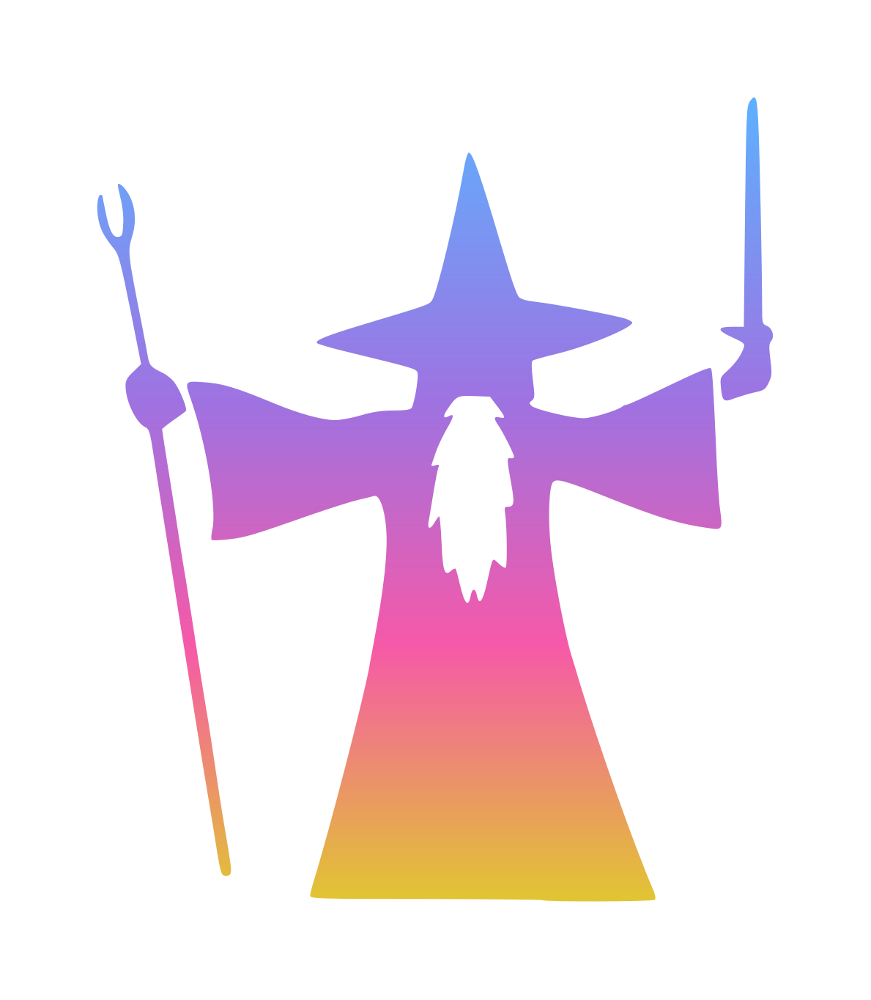

<p align="center">
  
</p>

# ysnp — You Shall Not Pass

[](https://github.com/uRadical/ysnp/actions/workflows/ci.yml)
[](https://github.com/uRadical/ysnp/actions/workflows/release.yml)
[](https://github.com/uRadical/ysnp/releases/latest)
[](LICENSE)


A cross-platform image overlay for Linux and macOS, written in pure C
(with one Objective-C file for macOS Cocoa). Designed to be fired from a git
`pre-push` hook when checks fail: it slaps an image above every other window,
centered on screen, until you click or press <kbd>Escape</kbd>.

## What it does

When invoked, `ysnp` displays an image, at its own native size and centered on
the screen, on top of all other windows. No arguments, no message — just the
image. Animated GIFs loop until dismissed. Click the image or press
<kbd>Escape</kbd> to close it.

## Install

### Prebuilt binary

Download the binary for your platform from the
[latest release](https://github.com/uRadical/ysnp/releases/latest):
`ysnp-linux-x86_64`, `ysnp-macos-arm64`, or `ysnp-macos-x86_64`.

```sh
chmod +x ysnp-*                  # make it executable
mv ysnp-* ~/.local/bin/ysnp      # put it on your PATH
mkdir -p ~/.config/ysnp/images   # where ysnp looks for images
```

Each release also ships a `SHA256SUMS` file you can verify against.

On macOS the binary is unsigned, so Gatekeeper quarantines it on first run.
Clear the flag (or right-click → Open once):

```sh
xattr -d com.apple.quarantine ~/.local/bin/ysnp
```

The Linux binary is dynamically linked against cairo, libjpeg, giflib and
wayland — if your distro ships incompatible library versions, build from source
instead (below).

### From source

See [Dependencies](#dependencies) and [Build](#build).

## Dependencies

**Linux**

- `wayland-client`
- `cairo`
- `libjpeg`
- `giflib`
- `wayland-scanner` (build-time, from `wayland-protocols`)
- A wlroots-based compositor (Sway, Hyprland, labwc, river, …) for the
  `wlr-layer-shell` protocol

**macOS**

- Xcode command line tools only (`clang` + the Cocoa framework)

## Build

```sh
make           # build ./ysnp
make install   # install to ~/.local/bin and create the images dir
make install-hook  # copy hooks/pre-push into this repo's .git/hooks/
make test      # run the unit tests (AddressSanitizer + UBSan)
make debug     # rebuild with -g -O0 -fsanitize=address,undefined
make clean     # remove build/ and the binary
```

`make install` copies the binary to `~/.local/bin/ysnp` and creates
`~/.config/ysnp/images/`. Make sure `~/.local/bin` is on your `PATH`.

## Project layout

```
src/      hand-written C / Objective-C sources
assets/   default.gif (embedded fallback) + vendored wlr-layer-shell protocol XML
build/    generated headers, objects, the wayland protocol glue (git-ignored)
hooks/    sample pre-push hook
tests/    unit tests
```

Hand-written code lives in `src/`; everything under `build/` is generated by
the Makefile (the embedded-image header via `xxd`, and on Linux the
`wlr-layer-shell` protocol code via `wayland-scanner`).

## Adding images

Drop `.png`, `.jpg`, `.jpeg`, or `.gif` files into `~/.config/ysnp/images/`
(extension match is case-insensitive). On each invocation `ysnp` picks one at
random. If the directory is empty or missing, it falls back to the compiled-in
default — the animated Gandalf "You shall not pass!" GIF.

The overlay is shown at the image's own native size, centered on the screen
(not stretched to fill).

## Git hook

Copy the sample hook into your repo and make it executable:

```sh
cp hooks/pre-push .git/hooks/pre-push
chmod +x .git/hooks/pre-push
```

Then edit `.git/hooks/pre-push` to run your actual tests or linters. When they
fail, the hook launches `ysnp` and blocks the push. (`make install-hook` will
copy the sample hook into the current repo for you.)

## The embedded default

The compiled-in fallback is the animated Gandalf "You shall not pass!" GIF
(`assets/default.gif`), so `ysnp` works out of the box with no external image.
Override it for everyday use by adding your own images to
`~/.config/ysnp/images/`.

## Diagnostics

`ysnp` is normally launched from a hook in the background (`ysnp &`), so a
failure that only printed to stderr would be invisible. Instead, every error is:

- **logged** to `$XDG_STATE_HOME/ysnp/ysnp.log` (falls back to
  `~/.local/state/ysnp/ysnp.log`), with a timestamp; and
- surfaced as a **desktop notification** (`notify-send` on Linux, `osascript` on
  macOS) so you see *why* nothing appeared — most usefully when the overlay
  can't be shown (e.g. running on a compositor without `wlr-layer-shell`).

If you ran a push and no overlay appeared, check that log first.

## Notes

- `main.c` contains zero `#ifdef`; all platform differences live in
  `overlay_wayland.c` (pure C) and `overlay_macos.m` (Objective-C).
- The Linux event loop is driven by `poll()` with a computed timeout — animated
  GIFs advance frames on schedule with no busy-looping; static images simply
  block until an input event arrives.
- GIF frame delays below 20 ms are clamped to 20 ms to avoid runaway loops on
  pathological files.

## License

MIT — see [LICENSE](LICENSE). The vendored `wlr-layer-shell` protocol
description (`assets/wlr-layer-shell-unstable-v1.xml`) carries its own MIT
copyright notice from the wlroots project.
